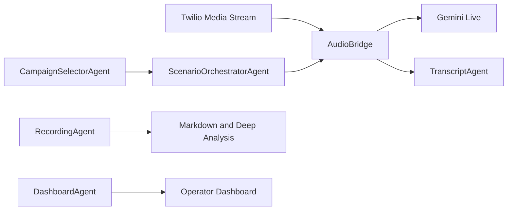

# PatientZero

## Submission Deliverables

- [Working code](./voicebot/src): Python voice bot implementation.
- [README](./README.md): Setup, ngrok-first run instructions, dashboard workflow, and troubleshooting.
- [Architecture doc](#agent-architecture): System architecture, agent responsibilities, and key design choices.
- [Call transcripts and recordings](./voicebot/favorited_recording_exports): 11 favorited calls with MP3 recordings, both-sided markdown transcripts, per-call reports, and deep-analysis reports.
- [Bug report](./voicebot/favorited_recording_exports/comprehensive_qa_report.md): Consolidated QA findings across the favorited calls.
- [Loom walkthrough video](TODO_ADD_LOOM_WALKTHROUGH_URL): Placeholder for the max 5-minute product/approach walkthrough.
- [AI debugging screen recording](TODO_ADD_AI_DEBUGGING_SCREEN_RECORDING_URL): Placeholder for the 5-minute recording showing prompting/debugging/fixing with AI.

`PatientZero` is an agentic Python voice-testing harness for stress testing a healthcare support line over real phone calls. It places outbound Twilio calls, streams live audio to Gemini through the official `google-genai` SDK, simulates realistic patient personas, captures recordings, and produces scenario-level QA reports in the dashboard.

## What It Does

- places outbound test calls through Twilio
- streams the call audio to Gemini Live for a real-time patient simulation
- runs pending-first scenario campaigns with reusable patient personas
- shows a persistent live transcript and operator dashboard
- saves call recordings plus JSON sidecars
- generates markdown run reports per recording
- generates deeper post-call analysis with Gemini Flash and a Flash Lite fallback
- exports favorited calls into a review bundle with recordings, reports, and Whisper transcripts
- coordinates calls through deterministic in-process agents instead of one large controller

## Stack

- Python 3.11+
- FastAPI
- Twilio Programmable Voice
- Gemini Live via the official `google-genai` SDK
- Pydantic Settings
- `structlog`
- `faster-whisper` for offline review transcripts
- `pytest`

## Project Layout

```text
.
├── .env.example
├── README.md
├── requirements.txt
├── run.sh
├── run_with_ngrok.sh
└── voicebot
    ├── data
    │   ├── master_scenarios.yaml
    │   └── test_personas.yaml
    ├── favorited_recording_exports
    ├── logs
    ├── recordings
    ├── src
    │   ├── agents
    │   ├── api
    │   ├── config
    │   ├── models
    │   ├── observability
    │   ├── realtime
    │   ├── runtime
    │   ├── telephony
    │   ├── testing
    │   └── utils
    └── tests
```

## Setup

1. Create and activate a virtual environment.

```bash
python3 -m venv .venv
source .venv/bin/activate
```

2. Install dependencies.

```bash
pip install -r requirements.txt
```

3. Copy the example env file and fill in your own values.

```bash
cp .env.example .env
```

## Required Environment Variables

- `TWILIO_ACCOUNT_SID`
- `TWILIO_AUTH_TOKEN`
- `TWILIO_PHONE_NUMBER`
- `MY_PHONE_NUMBER`
- `GEMINI_API_KEY`

## Useful Optional Environment Variables

- `PUBLIC_BASE_URL`
  - Public HTTPS base URL used for Twilio callbacks and media streaming.
- `APP_HOST`
- `APP_PORT`
- `LOG_LEVEL`
- `GEMINI_MODEL`
- `GEMINI_VOICE_NAME`
- `GEMINI_TEMPERATURE`
- `GEMINI_SYSTEM_INSTRUCTION`
- `GEMINI_DEEP_ANALYSIS_MODEL`
- `GEMINI_DEEP_ANALYSIS_FALLBACK_MODEL`
- `GEMINI_DEEP_ANALYSIS_ENABLED`
- `GEMINI_DEEP_ANALYSIS_TIMEOUT_SECONDS`
- `REPRESENTATIVE_TURN_SETTLE_SECONDS`
- `REPRESENTATIVE_ACTIVITY_AMPLITUDE_THRESHOLD`
- `TWILIO_BARGE_IN_AMPLITUDE_THRESHOLD`
- `TWILIO_BARGE_IN_MIN_CONSECUTIVE_FRAMES`
- `NGROK_REGION`

## Running Locally

For normal call testing, start the app with ngrok so Twilio can reach your local server:

```bash
./run_with_ngrok.sh
```

This starts the local FastAPI app, exposes it through ngrok, and sets `PUBLIC_BASE_URL` for Twilio callbacks and media streams.

If you only want to inspect the landing page or dashboard without placing calls, you can start the server without a public tunnel:

```bash
./run.sh
```

Then open the landing page:

```text
http://127.0.0.1:8000/
```

Open the operator dashboard at:

```text
http://127.0.0.1:8000/dashboard
```

The dashboard opens on the live chat view and includes:

- live patient and representative transcript rendering
- call controls
- scenario testing controls and campaign progress
- recording access
- markdown report and deep-analysis links when available

## Agent Architecture

PatientZero uses deterministic in-process agents. Gemini remains the simulated patient voice model, while Python agents coordinate state, tools, and evidence.



Current agents:

- `CallSessionAgent` wraps call lifecycle operations.
- `TranscriptAgent` owns transcript reset, live, and committed message state.
- `CampaignSelectorAgent` owns persona/scenario planning and pending-first preview selection.
- `ScenarioOrchestratorAgent` owns live scenario state and graceful scenario transitions.
- `RecordingAgent` owns recording listing, favorites, and artifact metadata.
- `DeepAnalysisAgent` wraps post-call audio analysis.
- `DashboardAgent` assembles the dashboard snapshot without owning call logic.

## Running With ngrok

Recommended for phone-call testing:

```bash
./run_with_ngrok.sh
```

This script:

- starts `ngrok http $APP_PORT`
- waits for the public HTTPS URL
- exports `PUBLIC_BASE_URL`
- starts the FastAPI app with that URL available to Twilio

Install ngrok first if needed:

```bash
brew install ngrok
ngrok config add-authtoken <your-token>
```

## Operator Workflow

1. Start the server.
2. Open the dashboard.
3. Review the next test-call preview.
4. Launch a test call from the Testing tab or place a direct outbound call.
5. Watch the live transcript and call state.
6. Use `Next Scenario` or `Change Scenario` if you want to move the live test forward manually.
7. Review the saved recording, markdown report, and deep analysis after the call completes.

## Testing Campaign Behavior

- The app prioritizes pending scenarios first, then failed scenarios, then already passed ones.
- Each upcoming run is previewed before a call is started.
- Manual scenario controls queue a hidden nudge after the representative finishes speaking, so transitions are smooth rather than abrupt.
- Resetting scenario progress clears current campaign coverage without deleting historical recordings or prior run artifacts.
- Historical runs stay visible for investigation and debugging.

## Artifacts

New recordings use a sequential naming scheme:

- `recording-0001.mp3`
- `recording-0001.json`
- `recording-0001.md`
- `recording-0001.deep-analysis.md`

Artifacts are stored in `voicebot/recordings/`.

The markdown report summarizes:

- persona used
- scenarios tested
- pass/fail outcomes
- transcript evidence
- linked recording information

The deep-analysis report sends the raw audio file to Gemini Flash for a second-pass QA review with a fallback to Flash Lite.

## Favorited Review Bundle

`voicebot/favorited_recording_exports/` is a curated QA bundle for the important calls that were favorited in the dashboard. It is intentionally different from the normal runtime `voicebot/recordings/` directory.

Each favorited call folder contains:

- the original `recording-####.mp3`
- the recording metadata sidecar, `recording-####.json`
- the normal scenario report, `recording-####.md`
- the deep-analysis report when available, `recording-####.deep-analysis.md`
- the accurate offline transcript, `whisper-large-v3-transcript.md`

The bundle also includes `comprehensive_qa_report.md`, which summarizes cross-call bugs and improvement opportunities with timestamped evidence. Whisper `.srt` and `.json` transcript exports are intentionally not included; the markdown transcript is the source used for review.

## Tests

Run the automated suite with:

```bash
pytest voicebot/tests
```

## Privacy And Commit Hygiene

- `.env`, virtualenv files, logs, normal runtime recordings, reports, and generated caches are ignored by git.
- `voicebot/favorited_recording_exports/` is the exception: it is a curated test-evidence bundle for this repo and should contain only approved demo/test recordings.
- Keep real phone numbers, API keys, production call recordings, and any accidental PII in local-only files.
- Use `.env.example` as the shareable template, not your local `.env`.

## Troubleshooting

`Twilio never connects to the media stream`

- Confirm `PUBLIC_BASE_URL` points to a reachable public HTTPS URL.
- Confirm the server is reachable from Twilio on port `443` through `wss://`.

`The call starts but there is no useful reply`

- Check the dashboard logs for Gemini session errors.
- Confirm your `GEMINI_API_KEY` is valid.
- Confirm the system prompt and testing persona files are present.

`Recordings appear but reports are missing`

- Give the app a moment to finish recording sync and post-call analysis.
- Check `voicebot/logs/app.log` for recording or deep-analysis failures.
